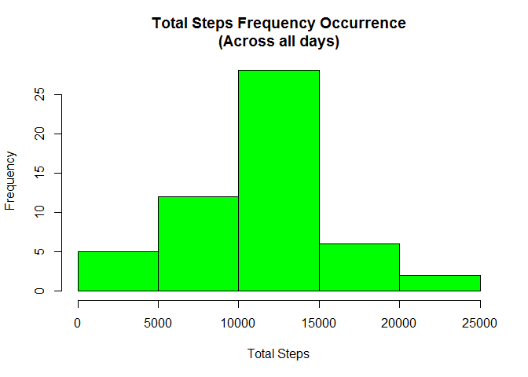
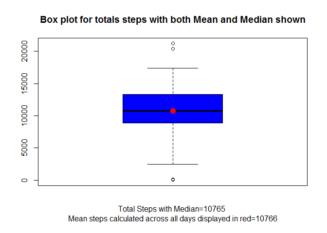
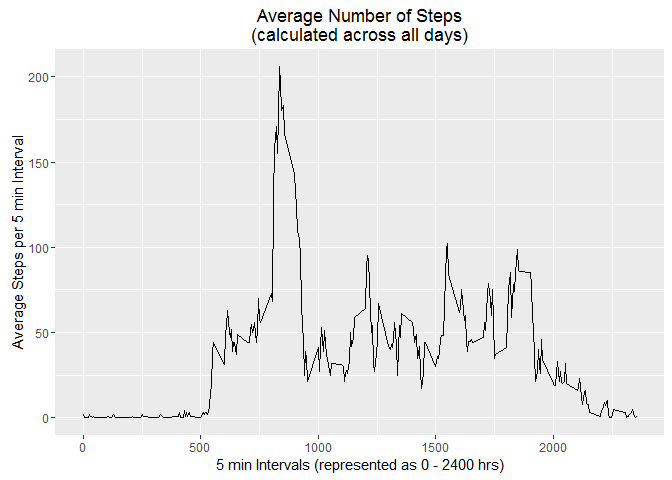
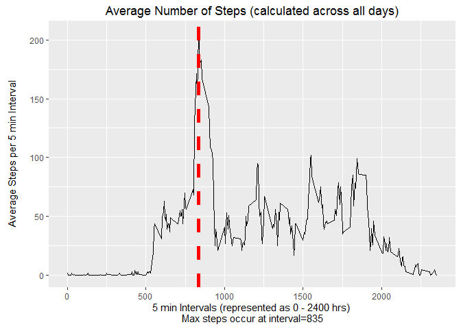
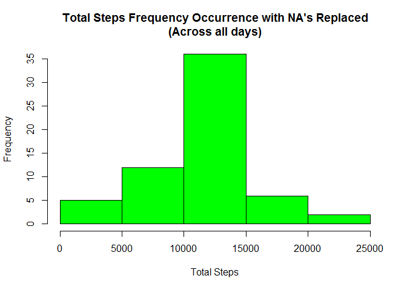
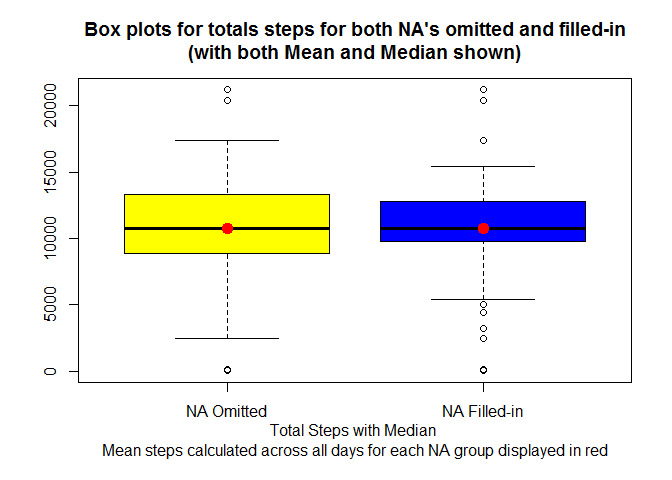
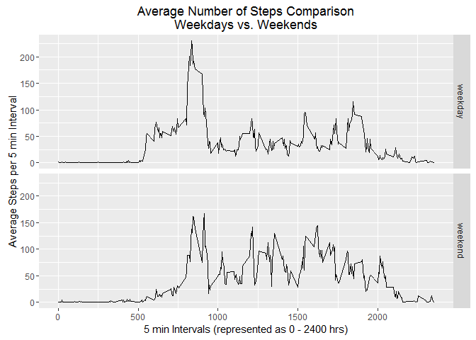

<B>Assignment Part 1:</B> Loading and preprocessing the data for project
1

    curPackages <- installed.packages()[,1]
    reqPackages <- c("data.table","dplyr","lubridate","sqldf")
    for (pkg in reqPackages){
         if (!is.element(pkg,curPackages))
              install.packages(pkg)
    }

    # Load the required packages if necessary
    library(data.table)
    library(dplyr)

    ## 
    ## Attaching package: 'dplyr'

    ## The following objects are masked from 'package:data.table':
    ## 
    ##     between, last

    ## The following objects are masked from 'package:stats':
    ## 
    ##     filter, lag

    ## The following objects are masked from 'package:base':
    ## 
    ##     intersect, setdiff, setequal, union

    library(ggplot2)
    library(lubridate)

    ## 
    ## Attaching package: 'lubridate'

    ## The following objects are masked from 'package:data.table':
    ## 
    ##     hour, mday, month, quarter, wday, week, yday, year

    # Load the dataset
    steps_raw <- fread("activity.csv",header=TRUE)
    steps_dt <- na.omit(steps_raw) %>% # Remove all rows with NA in steps column
         mutate(date=ymd(date))        # Change the character date to POSIX date

<B>Assignment Part 2:</B> Calculate the mean total number of steps taken
per day.  
<B>Task 1:</B> Calculate the total number of steps taken per day

    steps_total <- group_by(steps_dt,date) %>% summarise(total_steps = sum(steps))
    summary(steps_total)

    ##       date                      total_steps   
    ##  Min.   :2012-10-02 00:00:00   Min.   :   41  
    ##  1st Qu.:2012-10-16 00:00:00   1st Qu.: 8841  
    ##  Median :2012-10-29 00:00:00   Median :10765  
    ##  Mean   :2012-10-30 17:12:27   Mean   :10766  
    ##  3rd Qu.:2012-11-16 00:00:00   3rd Qu.:13294  
    ##  Max.   :2012-11-29 00:00:00   Max.   :21194

<B>Task 2:</B> Make a histogram of the total number of steps taken each
day

    hist(steps_total$total_steps,col="green", 
         xlab="Total Steps",
         main="Total Steps Frequency Occurrence\n(Across all days)")

<!-- -->

<B>Task 3:</B> Calculate and report the mean and median of the total
number of steps taken per day

    mean_steps <- mean(steps_total$total_steps)
    mean_steps

    ## [1] 10766.19

    median_steps <- median(steps_total$total_steps)
    median_steps

    ## [1] 10765

For visual clarity, the following code displays a boxplot of the steps
showing the median steps along with the calculated mean steps overlaid
with a red point.

    main="Box plot for totals steps with both Mean and Median shown"
    xLabel1 <- paste("Total Steps with Median",median_steps,sep='=')
    xLabel2 <- paste("\nMean steps calculated across all days displayed in red",round(mean_steps),sep='=')
    allLabel<- paste(xLabel1,xLabel2)

    boxplot(steps_total$total_steps, col = "blue", xlab=allLabel,main=main)
    points(c(mean_steps),col="red",lwd=6)

<!-- -->

<B>Assignment Part 3:</B> Calculate the average daily activity patterns.

<B>Task 1:</B> Make a time series plot (i.e. type = "l") of the 5-minute
interval (x-axis) and the average number of steps taken, averaged across
all days (y-axis)

    steps_ave <- group_by(steps_dt,interval) %>% 
         summarise(ave_steps = round(mean(steps)))    
    summary(steps_ave)

    ##     interval        ave_steps     
    ##  Min.   :   0.0   Min.   :  0.00  
    ##  1st Qu.: 588.8   1st Qu.:  2.75  
    ##  Median :1177.5   Median : 34.50  
    ##  Mean   :1177.5   Mean   : 37.37  
    ##  3rd Qu.:1766.2   3rd Qu.: 53.00  
    ##  Max.   :2355.0   Max.   :206.00

    qplot(interval,
          ave_steps,
          data=steps_ave,
          geom="line",
          xlab="5 min Intervals (represented as 0 - 2400 hrs)",
          ylab="Average Steps per 5 min Interval",
          main="Average Number of Steps\n(calculated across all days)")

<!-- -->

<B>Task/Question 2:</B> Which 5-minute interval, on average across all
the days in the dataset, contains the maximum number of steps?  
<B>Answer:</B> According to the data below interval 835 contains the
maximum average number steps of 206.

    interval_dt = filter(steps_ave,ave_steps=which.max(steps_ave$ave_steps))
    interval_dt

    ## Source: local data table [1 x 2]
    ## 
    ##   interval ave_steps
    ##      (int)     (dbl)
    ## 1      835       206

    print(paste("Interval which contains the maximum number of steps: ",interval_dt$interval,sep=" "))

    ## [1] "Interval which contains the maximum number of steps:  835"

    print(paste("The maxium average at that interval: ",interval_dt$ave_steps,sep=" "))

    ## [1] "The maxium average at that interval:  206"

For additional visual clarity, the following code displays the average
steps across all days at each interval and highlights the interval at
which the average max steps are taken:

    xLabel1 <- "5 min Intervals (represented as 0 - 2400 hrs)"
    xLabel2 <- paste("\nMax steps occur at interval",interval_dt$interval,sep='=')
    allLabel <- paste(xLabel1,xLabel2)
    qplot(interval,
          ave_steps,
          data=steps_ave,
          geom="line",
          xlab=allLabel,
          ylab="Average Steps per 5 min Interval\n",
          main="Average Number of Steps (calculated across all days)") +
          geom_vline(xintercept=interval_dt$interval, 
                     linetype="dashed",  color = "red",lwd=2)

<!-- -->

<B>Assignment Part 4:</B> Imputing missing values

The following code replaces all of the missing (i.e. NA) values with the
average value for the correspinding intervals previously calculated.

<B>Task 1:</B> Calculate and report the total number of missing values
in the dataset (i.e. the total number of rows with NAs)

    num_complete <- nrow(steps_dt)
    missing_values <- nrow(steps_raw) - num_complete
    missing_values

    ## [1] 2304

<B>Task 2:</B> Devise a strategy for filling in all of the missing
values in the dataset. The strategy does not need to be sophisticated.
For example, you could use the mean/median for that day, or the mean for
that 5-minute interval, etc.

and...

<B>Task 3:</B> Create a new dataset that is equal to the original
dataset but with the missing data filled in.

    steps_filled_dt <- mutate(steps_raw,
                              steps=ifelse(is.na(steps),
                              steps_ave$ave_steps,
                              steps_raw$steps)) %>% mutate(date=ymd(date))

    summary(steps_filled_dt)

    ##      steps             date               interval     
    ##  Min.   :  0.00   Min.   :2012-10-01   Min.   :   0.0  
    ##  1st Qu.:  0.00   1st Qu.:2012-10-16   1st Qu.: 588.8  
    ##  Median :  0.00   Median :2012-10-31   Median :1177.5  
    ##  Mean   : 37.38   Mean   :2012-10-31   Mean   :1177.5  
    ##  3rd Qu.: 27.00   3rd Qu.:2012-11-15   3rd Qu.:1766.2  
    ##  Max.   :806.00   Max.   :2012-11-30   Max.   :2355.0

<B>Task 4:</B> Make a histogram of the total number of steps taken each
day and Calculate and report the mean and median total number of steps
taken per day.

<B>Question:</B> Do these values differ from the estimates from the
first part of the assignment?  
<B>Answer:</B> Yes they do differ but only slightly and seem to have
negligible impact.

    steps_total_filled <- group_by(steps_filled_dt,date) %>% summarise(total_steps = sum(steps))       
    hist(steps_total_filled$total_steps,col="green", 
         xlab="Total Steps",
         main="Total Steps Frequency Occurrence with NA's Replaced\n(Across all days)")

<!-- -->

<B>Question:</B> What is the impact of imputing missing data on the
estimates of the total daily number of steps?  
<B>Answer:</B>From the data below it appears that the imputation of the
average for each interval to replace all NA values has verily little
impact on the median and mean steps taken across all days.

    mean_steps_filled <- mean(steps_total_filled$total_steps)
    median_steps_filled <- median(steps_total_filled$total_steps)

    print(paste("Mean/Median steps calculated with NA omitted:  ",paste(round(mean_steps),median_steps,sep="/"),sep=" "))

    ## [1] "Mean/Median steps calculated with NA omitted:   10766/10765"

    print(paste("Mean/Median steps calculated with NA Filled-in: ",paste(round(mean_steps_filled),median_steps_filled,sep="/"),sep=" "))

    ## [1] "Mean/Median steps calculated with NA Filled-in:  10766/10762"

The following code creates comparative boxplots for omitted and filled
in NA values.  
As you can see from this chart, the impact of replacing the NA values
with the average daily values calculated at each interval appears to be
small.

    main="Box plots for totals steps for both NA's omitted and filled-in\n(with both Mean and Median shown)"
    xLabel1 <-"Total Steps with Median"
    xLabel2 <- "\nMean steps calculated across all days for each NA group displayed in red"
    allLabel<- paste(xLabel1,xLabel2)

    boxplot(steps_total$total_steps,
            steps_total_filled$total_steps,
            names=c("NA Omitted","NA Filled-in"),
            col=c("yellow","blue"),
            xlab=allLabel,
            main=main)
    points(c(mean_steps,mean_steps_filled),col="red",lwd=6)

<!-- -->

<B>Assignment Part 5:</B> Weekday/Weekend Comparative Analysis  
<B>Question:</B> Are there differences in activity patterns between
weekdays and weekends?  
<B>Answer:</B> Yes, there appears to be more activity (i.e. greater
number of steps) during the weekdays in the morning hours but on average
more steps are taken on the weekends later in the day.

<B>Task 1:</B> Create a new factor variable in the dataset with two
levels - "weekday" and "weekend" indicating whether a given date is a
weekday or weekend day.

    steps_wDaytype <- mutate(steps_filled_dt, 
                           dayType=factor(ifelse(weekdays(date) %in% c("Saturday","Sunday"),
                                        "weekend",
                                        "weekday")))
    str(steps_wDaytype)

    ## Classes 'data.table' and 'data.frame':   17568 obs. of  4 variables:
    ##  $ steps   : num  2 0 0 0 0 2 1 1 0 1 ...
    ##  $ date    : POSIXct, format: "2012-10-01" "2012-10-01" ...
    ##  $ interval: int  0 5 10 15 20 25 30 35 40 45 ...
    ##  $ dayType : Factor w/ 2 levels "weekday","weekend": 1 1 1 1 1 1 1 1 1 1 ...
    ##  - attr(*, ".internal.selfref")=<externalptr>

<B>Task 2:</B> Make a panel plot containing a time series plot (i.e.
type = "l") of the 5-minute interval (x-axis) and the average number of
steps taken, averaged across all weekday days or weekend days (y-axis).

    steps_ave_b <- group_by(steps_wDaytype,interval,dayType) %>%    # Group dataset by 5 min interval
         summarise(ave_steps = round(mean(steps)))                  # Calculate the average across all intervals

    qplot(interval,
          ave_steps,
          data=steps_ave_b,
          facets= dayType ~ .,
          geom="line",
          xlab="5 min Intervals (represented as 0 - 2400 hrs)",
          ylab="Average Steps per 5 min Interval",
          main="Average Number of Steps Comparison\nWeekdays vs. Weekends")

<!-- -->
